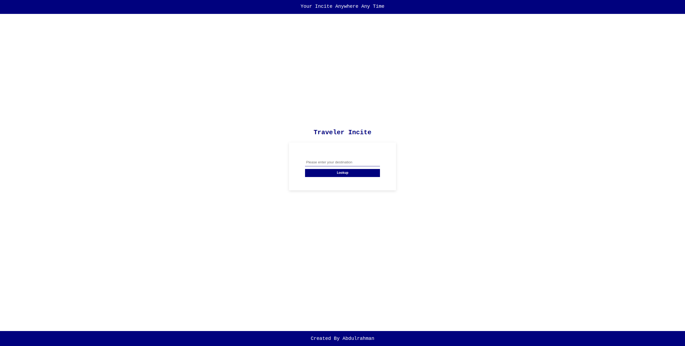

# Project 5: FEND Capstone - Travel App

## Overview

This project is part of Udacity's Nanodegree in Front End Development. According to the course:
> You must create a web tool that allows users to run Natural Language Processing (NLP) on articles or blogs found on other websites for this project.

This project requires you to build out a travel app that, at a minimum, obtains a desired trip location & date from the user, and displays weather and an image of the location using information obtained from external APIs. Given that this is the Capstone project, it's highly encouraged for you to go above and beyond, adding additional functionality and customization to truly stand out with a project you are proud to have at the top of your portfolio!

## Preview



## Instructions
### Setting up the Project :computer:
Clone or download the zip file locally after forking the project's Github repo. Navigate to the project directory to install all dependencies once you have the project locally.
```
make sure that you use node v14 as instructed in course
cd <project directory>
npm install
```

### Signup for an API key :key:
First, you will need to go
[here](https://www.geonames.org/)
[here](https://www.weatherbit.io/)
[here](https://pixabay.com/)

and register for an account. Signing up will get you an API key.

Make a new file called `.env` in the project's root directory. Insert the following line into the file, replacing the stars with your personal API key.
`GEOCODES_NAME=***************`
`WEATHERBIT_KEY=***************`
`PIXABAY_KEY=***************`

### After setup :fire:

You're ready to use it once you've created a local copy and added your API keys to the `.env` file.

npm run dev | to run the express server
npm run build-dev
```
To run the production server (with express), run these commands
```
npm run build-prod
npm run start
```